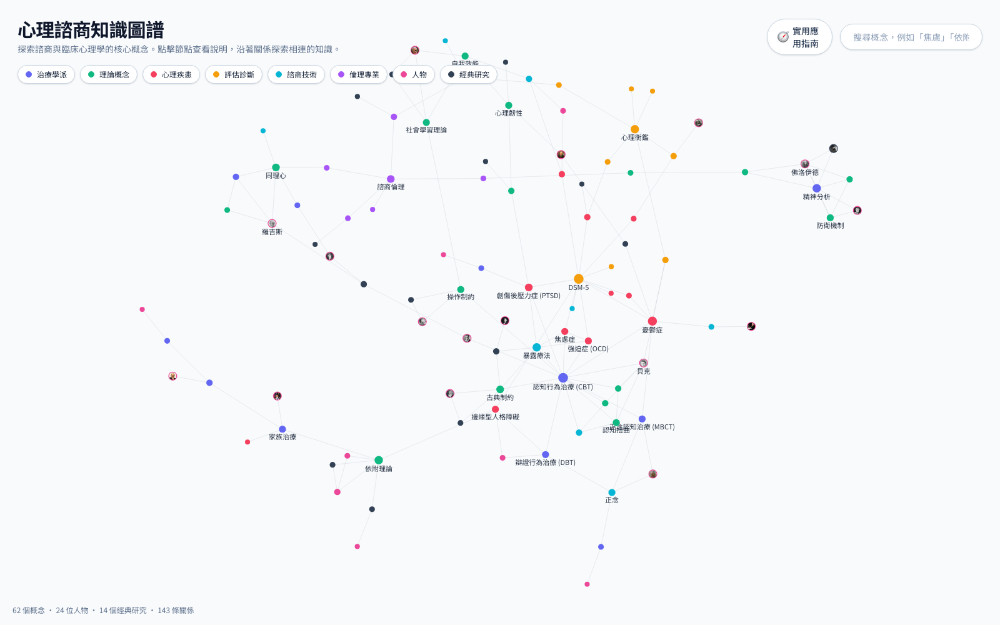
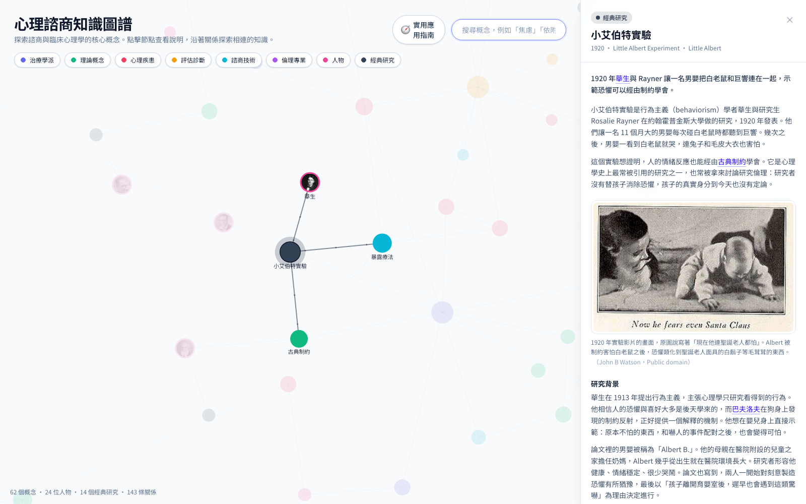
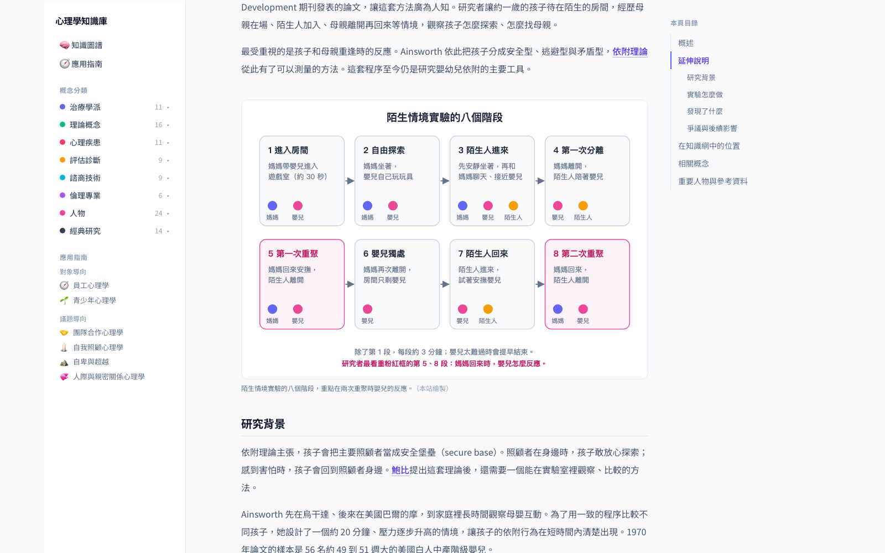
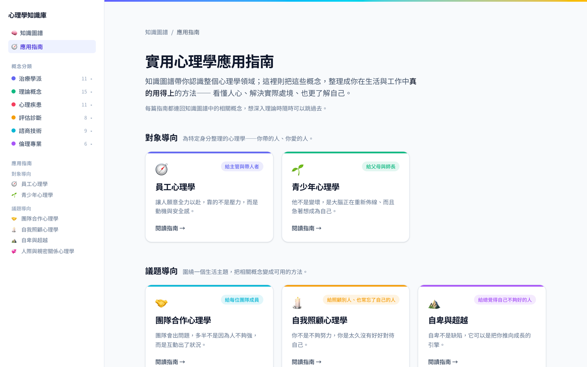

# 心理諮商知識圖譜

> An interactive knowledge graph of counseling and clinical psychology, in Traditional Chinese.

諮商與臨床心理學的核心概念，用一張可以點的圖譜串起來。62 個概念、24 位代表人物、14 個經典研究、143 條關係，分成八類。點一個節點，右側會出現分段的深入說明、人物照片與實驗圖片，說明裡提到的其他概念可以直接點過去，再沿著關係往下探索。

**網站：https://hsuiris.github.io/psych-knowledge-graph/**



## 為什麼做這個

教科書用章節排列知識，但概念之間其實是網狀的。移情和反移情是一組對應關係，兩者都是精神分析的工作素材；暴露療法屬於認知行為治療的技術，用來處理焦慮症和創傷後壓力症。這些關係在書裡要跨章節才拼得出來，圖譜可以直接看到。

## 功能

### 點概念看說明，沿關係探索

點任何一個節點，右側出現完整說明、重要人物與相關概念。說明文字裡提到的其他概念或人物會自動變成連結，例如精神分析的說明寫到「佛洛伊德」「潛意識」「移情」，點下去就跳到那個節點。相關概念依關係方向與類型排成句子，例如「精神分析 運用 移情」「佛洛伊德 創立 精神分析」。跳過去時圖譜跟著聚焦，其他節點淡化。

人物節點在圖上直接顯示照片，側欄有生卒年、生平與貢獻。

### 經典研究

14 個影響諮商與臨床心理學的研究與案例，例如巴夫洛夫的狗、小艾伯特實驗、陌生情境實驗、米爾格倫服從實驗、塔拉索夫案。每個研究都寫了背景、怎麼做、發現與後續爭議，並附上實驗照片或本站繪製的流程示意圖。研究節點也連到它證明或啟發的理論，例如小艾伯特實驗連到古典制約與暴露療法。



### 每個概念都有獨立頁面

100 個節點各有一頁，含定義、分段說明、附圖、關係列表與參考書目，網址可以直接分享。內文一樣會自動連到其他概念頁。這些頁面是靜態產生的，搜尋引擎爬得到。



### 實用應用指南

六個生活情境的導覽頁，把相關概念串成一條閱讀路線，例如青少年心理、職場團隊、員工心理。



### 其他

- 八類著色：治療學派、理論概念、心理疾患、評估診斷、諮商技術、倫理專業、人物、經典研究。點圖例可以只看某幾類。
- 模糊搜尋：輸入概念名稱、英文或別名，選取後圖譜自動聚焦。
- 樞紐概念（連結數 4 以上）在任何縮放層級都顯示名稱。

## 技術

| 項目 | 選擇 | 理由 |
| --- | --- | --- |
| 框架 | Next.js 16 App Router + TypeScript | 100 個概念頁用 `generateStaticParams` 靜態產生 |
| 圖譜 | react-force-graph-2d（Canvas） | 100 節點的力導向布局，拖曳與縮放都順 |
| 搜尋 | Fuse.js | 純前端模糊比對，不需要後端或金鑰 |
| 樣式 | Tailwind CSS 4 | |
| 部署 | GitHub Pages，靜態輸出 | 全站零後端、零金鑰，111 頁全部預先產生 |

## 資料

節點與關係放在 `src/data/graph.json`，概念說明放在 `src/data/details.json`（型別在 `details.ts`）。

圖片有兩種來源：

- 人物照片（`public/people/`）與概念、研究的附圖（`public/images/`）來自 Wikimedia Commons，作者與授權記錄在 `src/data/portraits.json` 和 `src/data/images.json`。要重新下載或加新圖，改 `scripts/fetch-images.mjs` 裡的清單再跑 `node scripts/fetch-images.mjs`。
- 流程示意圖（`public/diagrams/`）由 `python3 scripts/draw-diagrams.py` 產生，說明文字在 `src/data/diagrams.json`。

說明文字的自動連結由 `src/lib/linkify.ts` 處理，比對節點的名稱、括號裡的原文與別名。改了比對規則後跑 `npm test` 檢查邊界情況。

```jsonc
{
  "nodes": [
    { "id": "cbt", "label": "認知行為治療 (CBT)", "category": "therapy",
      "aliases": ["CBT"], "description": "…" }
  ],
  "links": [
    { "source": "cbt", "target": "depression", "relation": "用於治療" }
  ]
}
```

`category` 必為 `therapy`、`theory`、`disorder`、`assessment`、`technique`、`ethics`、`person`、`study` 其中之一。人物與經典研究另外有 `years`（生卒年或研究年份）。

`scripts/extract.ts` 是擴充用的腳本：讀一份來源文本，請 LLM 抽出概念與關係，再合併進圖譜，依 id 去重、自動丟棄接不到節點的邊。擴充要自己的 API 金鑰，網站本體不需要。

```bash
export ANTHROPIC_API_KEY=...   # 或 OPENAI_API_KEY
npm run extract path/to/source.txt
```

## 本機跑起來

```bash
npm install
npm run dev      # http://localhost:3000
npm run build    # 靜態輸出到 out/
```

## 下一步

- 語意搜尋：把 Fuse.js 的字面比對換成 embedding，讓「我一直想討好別人」這種描述也搜得到相關概念。
- 每個概念目前附參考書目，下一步逐段標註出處。

## 授權

程式碼 MIT。概念說明為自行整理，不是教科書逐字內容。照片與附圖來自 Wikimedia Commons，依各自的授權使用（公有領域、CC0、CC BY、CC BY-SA），作者與授權標在每張圖下方。流程示意圖為本站繪製。
